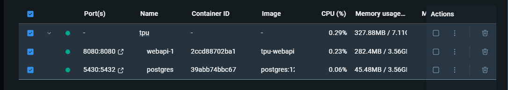

# Студенты

## Описание проекта

Это приложение, реализованное с использованием Spring Boot и PostgreSQL
представляет собой API, которое позволяет искать студентов по определенным параметрам.

## Основной функционал

- Создание студентов
- Создание групп
- Получение информации о студенте по идентификатору
- Получение списка всех студентов
- Получение списка студентов, обучающихся в выбранной группе, отсортированных по ФИО
- Поиск студентов, отсортированных по ФИО, по следующим параметрам (параметры могут быть совмещены):
    - Идентификатор
    - Фамилия
    - Имя
    - Отчество
    - Название группы
    - Дата рождения (интервал)
    - Пол
    - Статус студента
    - Номер курса

## Стек

- Java 21;
- Maven;
- Lombok;
- PostgreSQL 12;
- JDBI;
- Hibernate Validator;
- Spring Boot 3.4.1;
- Spring Web;
- Liquibase;
- Docker;

Для написания тестов используются: JUnit5, Mockito.

## Шаги для запуска

1. Клонируйте репозиторий:
    ```shell
   git clone https://github.com/basketcase7/tpu_students.git
   cd tpu_students
   ```
2. Выполните сборку проекта (без тестов):
    ```shell
    mvn clean package -DskipTests
    ```
   или (для Windows):
    ```shell
    mvnw.cmd clean package -DskipTests
    ```
3. Запустите Docker Compose для сборки и запуска сервисов:
   ```shell
   docker-compose up --build
   ```

4. Docker Compose создаст два контейнера:
    - webapi-1: контейнер для веб-приложения Spring Boot.
    - postgres: контейнер для базы данных PostgreSQL.



5. После успешного запуска, приложение будет доступно по адресу: http://localhost:8080.

6. Для остановки контейнеров выполните:
   ```shell
   docker-compose down
   ```
7. Для запуска тестов выполните:
   ```shell
   mvn test
   ```
   или
    ```shell
    mvnw.cmd test
    ```

## Примеры использования API

### GROUP

### POST http://localhost:8080/api/group

#### Описание:

Создание новой группы.

#### Request:

```json
{
  "name": "8K23",
  "department": "OIT",
  "enrollmentYear": "2022"
}
```

#### Response:

*200(OK):*

```json
{
  "id": "f0c94c80-2699-4f3e-a9b9-170d2f076398",
  "name": "8K23",
  "department": "OIT",
  "enrollmentYear": 2022
}
```

#### Request:

```json
{
  "name": "",
  "department": "",
  "enrollmentYear": ""
}
```

#### Response:

*400(Bad Request):*

```json
{
  "status": 400,
  "message": "Ошибка валидации",
  "timeStamp": "2025-01-04T15:16:50.646311264",
  "fieldErrors": [
    {
      "field": "name",
      "errorMessage": "Имя группы не должно быть пустым"
    },
    {
      "field": "enrollmentYear",
      "errorMessage": "Год набора не должен быть пустым"
    },
    {
      "field": "department",
      "errorMessage": "Подразделение группы не должно быть пустым"
    }
  ]
}
```

### STUDENT

### POST http://localhost:8080/api/student

#### Описание:

Создание нового студента.

#### Request:

```json
{
  "firstName": "Anton",
  "lastName": "Kuznetsov",
  "middleName": "Sergeevich",
  "groupId": "d3105931-c335-4af6-a3c0-1b7245318eb7",
  "dateOfBirth": "2025-08-30",
  "gender": "MALE",
  "status": "EXPELLED"
}
```

#### Response:

*200(OK):*

```json
{
  "id": "5b4b653b-895d-4a56-adb7-400dadbcfd16",
  "lastName": "Anton",
  "firstName": "Kuznetsov",
  "middleName": "Sergeevich",
  "groupId": "d3105931-c335-4af6-a3c0-1b7245318eb7",
  "dateOfBirth": "2025-08-30",
  "gender": "MALE",
  "status": "EXPELLED"
}
```

#### Request:

```json
{
  "firstName": "",
  "lastName": "",
  "middleName": "",
  "groupId": "d3105931-c335-4af6-a3c0-1b7245318eb7",
  "dateOfBirth": "20225-08-30",
  "gender": "MALE",
  "status": "EXPELLED"
}
```

#### Response:

*400(Bad Request):*

```json
{
  "status": 400,
  "message": "Ошибка валидации",
  "timeStamp": "2025-01-04T15:23:12.170321781",
  "fieldErrors": [
    {
      "field": "dateOfBirth",
      "errorMessage": "Дата рождения должна быть в формате YYYY-MM-DD"
    },
    {
      "field": "firstName",
      "errorMessage": "Фамилия студента не должна быть пустой"
    },
    {
      "field": "lastName",
      "errorMessage": "Имя студента не должно быть пустым"
    }
  ]
}
```

#### Request:

```json
{
  "firstName": "Anton",
  "lastName": "Kuznetsov",
  "middleName": "Sergeevich",
  "groupId": "d3105931-c335-4af6-a3c0-1b6245318eb7",
  "dateOfBirth": "2025-08-30",
  "gender": "MALE",
  "status": "EXPELLED"
}
```

#### Response:

*404(Not Found):*

```json
{
  "status": 404,
  "message": "Группа не найдена",
  "timestamp": "2025-01-04T15:24:11.119121808"
}
```

### GET http://localhost:8080/api/student/{id}

#### Описание:

Получение студента по идентификатору.

#### Responses:

*200(OK):*

```json
{
  "id": "f3206d08-6529-443c-b02c-2c7f43f72096",
  "lastName": "Anton",
  "firstName": "Kuznetsov",
  "middleName": "Sergeevich",
  "groupId": "d3105931-c335-4af6-a3c0-1b7245318eb7",
  "dateOfBirth": "2025-08-30",
  "gender": "MALE",
  "status": "EXPELLED"
}
```

*404(Not Found):*

```json
{
  "status": 404,
  "message": "Студент не найден",
  "timestamp": "2025-01-04T15:27:57.144606862"
}
```

### GET http://localhost:8080/api/student

#### Описание:

Получение всех студентов.

#### Responses:

*200(OK):*

```json
[
  {
    "id": "c3b95e55-a9a3-41b9-9aa6-17a1b738985c",
    "lastName": "Anton",
    "firstName": "Kuznetsov",
    "middleName": "Sergeevich",
    "groupId": "c28527f7-eca3-4591-8433-2923c6731410",
    "dateOfBirth": "2025-08-30",
    "gender": "MALE",
    "status": "EXPELLED"
  },
  {
    "id": "9b31b4e0-de9c-4672-8323-dda47ee93746",
    "lastName": "Bogdan",
    "firstName": "Antonov",
    "middleName": "Andreevich",
    "groupId": "c28527f7-eca3-4591-8433-2923c6731410",
    "dateOfBirth": "2023-06-30",
    "gender": "MALE",
    "status": "EXPELLED"
  }
]
```

### GET http://localhost:8080/api/student/group/{groupId}

#### Описание:

Получение всех студентов группы, отсортированных по ФИО.

#### Responses:

*200(OK):*

```json
[
  {
    "id": "9b31b4e0-de9c-4672-8323-dda47ee93746",
    "lastName": "Bogdan",
    "firstName": "Antonov",
    "middleName": "Andreevich",
    "groupId": "c28527f7-eca3-4591-8433-2923c6731410",
    "dateOfBirth": "2023-06-30",
    "gender": "MALE",
    "status": "EXPELLED"
  },
  {
    "id": "c3b95e55-a9a3-41b9-9aa6-17a1b738985c",
    "lastName": "Anton",
    "firstName": "Kuznetsov",
    "middleName": "Sergeevich",
    "groupId": "c28527f7-eca3-4591-8433-2923c6731410",
    "dateOfBirth": "2025-08-30",
    "gender": "MALE",
    "status": "EXPELLED"
  }
]
```

*404(Not Found):*

```json
{
  "status": 404,
  "message": "Группа не найдена",
  "timestamp": "2025-01-04T15:39:25.072699991"
}
```

*404(Not Found):*

```json
{
  "status": 404,
  "message": "Студенты не найдены",
  "timestamp": "2025-01-04T15:39:55.958731815"
}
```

### GET http://localhost:8080/api/student/search

#### Описание:

Получить список студентов, отсортированных по ФИО, подходящих под заданные параметры.

Список параметров:
- Идентификатор (id)
- Фамилия (lastName)
- Имя (firstName)
- Отчество (middleName)
- Название группы (groupName)
- Дата рождения (интервал: startBirth, endBirth)
- Пол (gender)
- Статус студента (status)
- Номер курса (yearOfStudying)

#### Пример Request:

GET http://localhost:8080/api/student/search?startBirth=2015-05-05&gender=MALE

#### Response:

*200(OK):*

```json
[
  {
    "id": "a5239e14-2a16-4f7a-831b-5b935e91e178",
    "lastName": "Bogdan",
    "firstName": "Antonov",
    "middleName": "Andreevich",
    "groupId": "c28527f7-eca3-4591-8433-2923c6731410",
    "dateOfBirth": "2023-06-30",
    "gender": "MALE",
    "status": "EXPELLED"
  },
  {
    "id": "6d0c0eb8-64ac-4bca-a642-c5d540864039",
    "lastName": "Anton",
    "firstName": "Kuznetsov",
    "middleName": "Sergeevich",
    "groupId": "c28527f7-eca3-4591-8433-2923c6731410",
    "dateOfBirth": "2025-08-30",
    "gender": "MALE",
    "status": "EXPELLED"
  }
]
```

#### Пример Request:

GET http://localhost:8080/api/student/search?startBirth=2015-05-05&gender=FEMALE

#### Response:

*404(Not Found):*

```json
{
  "status": 404,
  "message": "Студенты не найдены",
  "timestamp": "2025-01-04T15:47:36.414101539"
}
```

#### Пример Request:

GET http://localhost:8080/api/student/search?startBirth=20215-05-05&yearOfStudying=15

#### Response:

*400(Bad Request):*

```json
{
  "status": 400,
  "message": "Ошибка валидации",
  "timeStamp": "2025-01-04T15:49:12.470882804",
  "fieldErrors": [
    {
      "field": "yearOfStudying",
      "errorMessage": "Год обучения должен быть не больше 10"
    },
    {
      "field": "startBirth",
      "errorMessage": "Дата рождения должна быть в формате YYYY-MM-DD"
    }
  ]
}
```